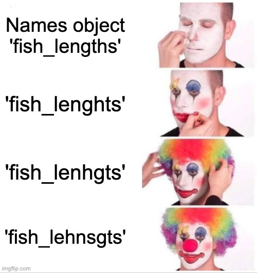
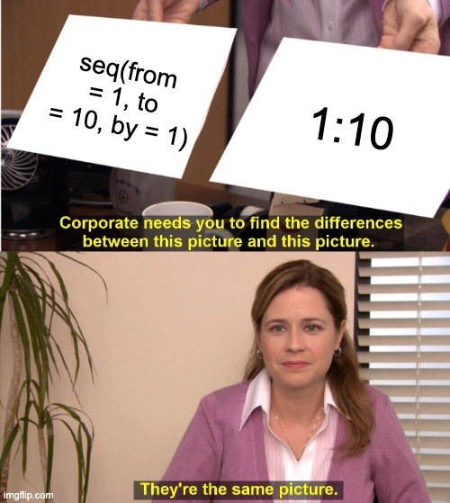

```{r xaringan-themer, include=FALSE, warning=FALSE}
### setup chunk
# load packages
library(xaringanthemer)
library(fontawesome)
library(emo)
library(tidyverse)
style_duo_accent_inverse(code_highlight_color = "#cc5500",
  primary_color = "#85D3D1",
  secondary_color = "#0D2A47",
  code_inline_color = "grey",
  inverse_background_color = "#85D3D1",
  inverse_text_color = "#0D2A47",
  code_inline_background_color = "#0D2A47",
  header_font_google = google_font("Josefin Sans"),
  text_font_google   = google_font("Montserrat", "300", "300i"),
  code_font_google   = google_font("Fira Mono"),
  colors = c(orange = "#cc5500",
         teal = "#85D3D1")
)
```

```{css, echo = FALSE}

.scrollable {
  height: 300px;
  overflow-y: auto;
}


.scrollable-auto {
  height: 75%;
  overflow-y: auto;
}

.remark-slide-scaler {
    overflow-y: auto;
}
```

# Basics
## Slide setup

Tips and explanations `r emo::ji("arrow_left")` this type of text contains prompts, tips, and tricks

.code-teal[
```{r, echo = TRUE}
# R code is delineated in these boxes
# hashmarks in R code are annotations, not functional code

"I am a penguin" # <- this is actual code
```
]

`r emo::ji("arrow_up")`   Code outputs appear below each chunk of code    `r emo::ji("arrow_up")`
---

## Access your workspace

To confirm that you're in the right place, you can write getwd() to get your working directory

```{r, echo = TRUE}
# use getwd() to find out where you are
getwd()
```

`r emo::ji("arrow_right")` This looks great. If you're inside your project (as indicated on the upper right corner of your RStudio environment), your working directory should be automatically set to your project directory. 

`r emo::ji("arrow_right")` Think of your R-project as a box that contains everything you need to bake a cake. Within it, you may have smaller boxes that contain ingredients, instructions, or tools. 
---
## Packages `r emo::ji("package")`

R is user maintained, and most of its functionality comes from **packages** that contain a set of different functions to accomplish tasks. Some packages (such as the _base_ package) come pre-installed, but the vast majority of packages need to be installed and loaded.

Below, we are installing the _tidyverse_ package using the <span style="color:orange"> *install.packages()* </span> function 

```{r, echo = TRUE, results = 'hide'}
# you typically don't need to set repos when installing a package
#install.packages("tidyverse", repos = "http://cran.us.r-project.org")
```

Installing the package downloads its contents to your R library. Before you can start using it, however, you have to load it into your current R session. We can do this using the <span style="color:orange"> *library()* </span> function.

```{r, echo = TRUE}
# load the tidyverse package in your current R session
library(tidyverse)
```

You only need to install packages once, but you will have to re-load the packages you need each time you start a new R session.
---
## Common operators

- "?" opens help
- "<-" assigns the right side to the left side
- "==" indicates whether the left side matches the right

.pull-left[ Getting help and assigning values

```{r, echo = TRUE, results='markup'}
# get help
?install.packages

# assign value
one <- 1
one

five <- 5
five
```
]

.pull-right[ Check for matches

```{r, echo = TRUE, results = 'markup'}
# check matching values (TRUE or FALSE)
5 == 5

5 == 6

five == 5

```
]
---
class: middle

## R as a calculator

- R works as a basic calculator, using the same annotation you would typically use. 

- It also understands a diverse range of mathematical functions as part of the _base_ package, such as <span style="color:orange"> *log()* </span>, <span style="color:orange"> *sqrt()* </span>, or <span style="color:orange"> *sin()* </span>  

```{r, echo = TRUE, results='markup'}
# four times four
4*4

# a much more complicated calculation
23*sin(19)/sqrt(12) + log(58)

# be careful to observe basic rules 
2 * 2 + 5 == 2 * (2 + 5)
```
---

## Naming objects


- you can name objects however you want, but misspelling names is one of the most common errors
- try to develop a standardized system for naming objects!
- for example, separate object names by "." or "_" and don't use capitals (e.g. "fish.data")

.pull-left[
```{r, echo = TRUE}
# assign obj1 the value of 4*4
obj1 <- 4*4
obj1
# assign obj2 a more complex value
obj2 <- 23/sqrt(58)*21^2
obj2
# assign obj3 a non-numerical value
obj3 <- "fish"
obj3
```
]

.pull-right[
```{r echo=FALSE, out.width="75%"}

```
]
---

## Combine objects

- you can readily combine numeric objects, but you cannot combine a numeric and non-numeric objects

```{r, echo = TRUE, results ='markup', error = TRUE}
obj4 <- obj1 + obj2 # combine numeric objects
obj4

obj5 <- obj1 + obj3 # attempt to combine numeric and character
```
`r emo::ji("cry")`

- to combine numbers and characters, you need to use a specialized function such as  <span style="color:orange"> *paste()* </span>

```{r, echo = TRUE, results='markup'}
obj6 <- paste(obj1,obj3) # using the paste function
obj6
```
---
class: inverse, center, top

# Exercise 1.1 `r emo::ji("weight_lifting_woman")`

### a) Find your current working directory.

### b) Test whether:

```{r, error = TRUE, echo = TRUE, results='hide'}
(6 * 1^3 + 1)^3 - (6 * 1^3 - 1)^3 - (6 *1^2)^3
``` 
### yields the same value as
```{r, error = TRUE, echo = TRUE, results='hide'}
(sin(2) + cos(2))^2 + (sin(2) - cos(2))^2
```

### c) Create an object that contains MCE, an object that contains the number 2024, and a new object that combines the two.   
---
class: middle, center

# Functions and vectors
# `r emo::ji("gear")`

---

## Functions

- denoted by parentheses
- perform basic (or very sophisticated) operations with your objects
- you have already used them! `r emo::ji("light")`

```{r, echo = TRUE}
obj8 <- 9
sqrt(obj8) # sqrt() is a function

obj9 <- paste("fish", "rule") # paste() is a function
obj9
```
---

## Vectors

- objects that contain multiple elements 
- simplest data structure in R

```{r, echo = TRUE, results='markup'}
conc.vals <- c(1,2,3,4,5) # c() is the concatenate function - use it to combine numbers
conc.vals # we have created a cevtor with five numbers

conc.text <- c("fish1", "fish2", "fish3", "fish4") # or use it to string together words
conc.text # we have created a vector with four words

conc.fish <- c("<º(((><", "<º(((><", "<º(((><") # you can concatenate almost anything
conc.fish
```
---
## Vectors `r emo::ji("handshake")` Functions 
### Create vectors using functions
- functions consist of **arguments** that need to be specified
- the <span style="color:orange"> *seq()* </span> function creates sequence vectors
- its basic arguments are **_from_**, **_to_**, and **_by_**

```{r, echo = TRUE, results = 'markup'}
seq1 <- seq(from = 1, to = 10, by = 1) # create a sequence from 1 to 10 in intervals of 1
seq1

seq2 <- seq(1, 10, 1) # you don't have to spell out arguments but it's safer to do so
seq2

seq3 <- 1:10 # with an easy sequence like this, you can also do this
seq3
```
---

.pull-left[
### There are often many ways to perform the same operation! `r emo::ji("clown")`

### As the tasks at hand get more complex, you're less likely to find alternative pathways 

.scrollable[
```{r, echo = c(2,3), results='markup'}
options(width = 45)
seq4 <- seq(from = 0, to = 12167, by = 23)
seq4
```
]
]

.pull-right[
```{r echo=FALSE, out.width="95%"}

```
]
---
### Create vectors with repetitions
- the <span style="color:orange"> *rep()* </span> function creates repititions
- its basic arguments are **_x_** (the element to be replicated) and your choice of  **_times_** and/or **_each_** 


```{r, echo = (-1), results='markup'}
options(width = 100)
rep1 <- rep(1:5, times = 10) # replicate the sequence 1:5 ten times
rep1

rep2 <- rep(1:5, esach = 10) # replicate each element in 1:5 ten times
rep2 # notice the difference between 'times' and 'each'

rep3 <- rep("fish", times = 8) # you can also repeat text
rep3
```
---
### Combining functions to create vectors

- you can use functions within functions (like the <span style="color:orange"> *seq()* </span> function within the <span style="color:orange"> *rep()* </span> function)
- there's no real limit to how many functions you can nest within each other (but going over board may get a little messy)

```{r, echo = TRUE, results='markup'}
rep4 <- rep(seq(from = 0, to = 10, by = 2), times = 3) # use seq() within rep() 
rep4 

mean.rep <- mean(rep(seq(from = 0, to = 10, by = 2), times = 3)) # use mean(), seq(), and rep()
mean.rep
```
---
### Performing functions on vectors

- as the previous operation suggests, you can use functions across vectors

```{r, echo = TRUE, results='markup'}
reps.comb <- c(rep2, rep4) # combine two numerical vectors
reps.comb

log.rep2 <- log(rep2) # take the log of rep2
log.rep2

reps.diff1 <- paste(rep2, rep3) # using paste() to combine vectors of different classes
reps.diff1 

reps.diff2 <- paste(rep3, rep4) # same operation, but different combination
reps.diff2
```

