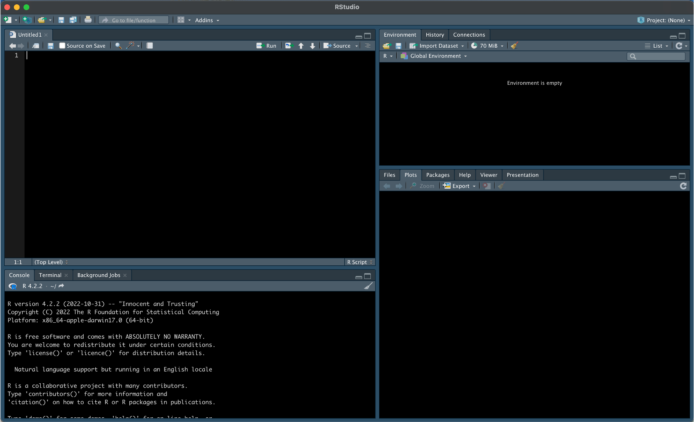
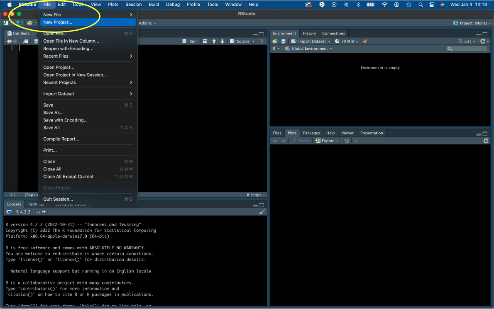
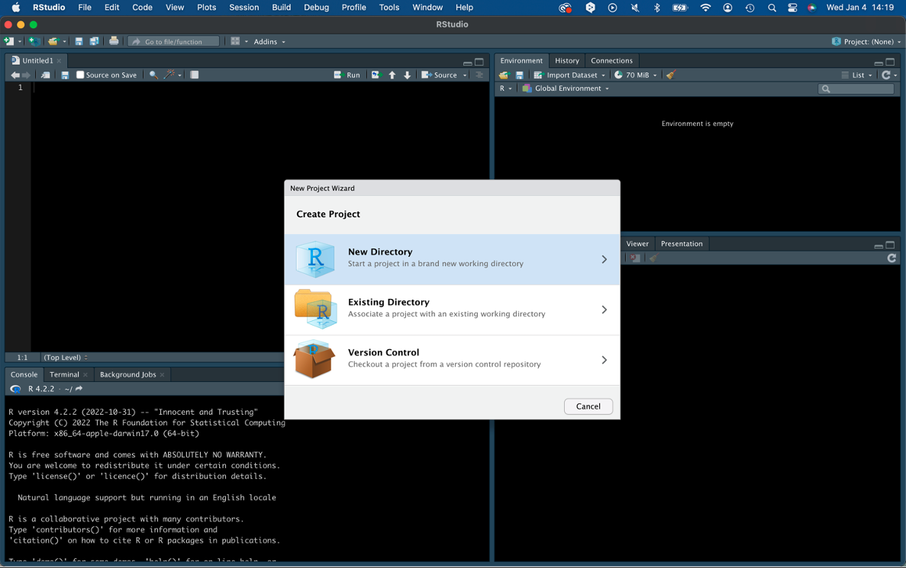
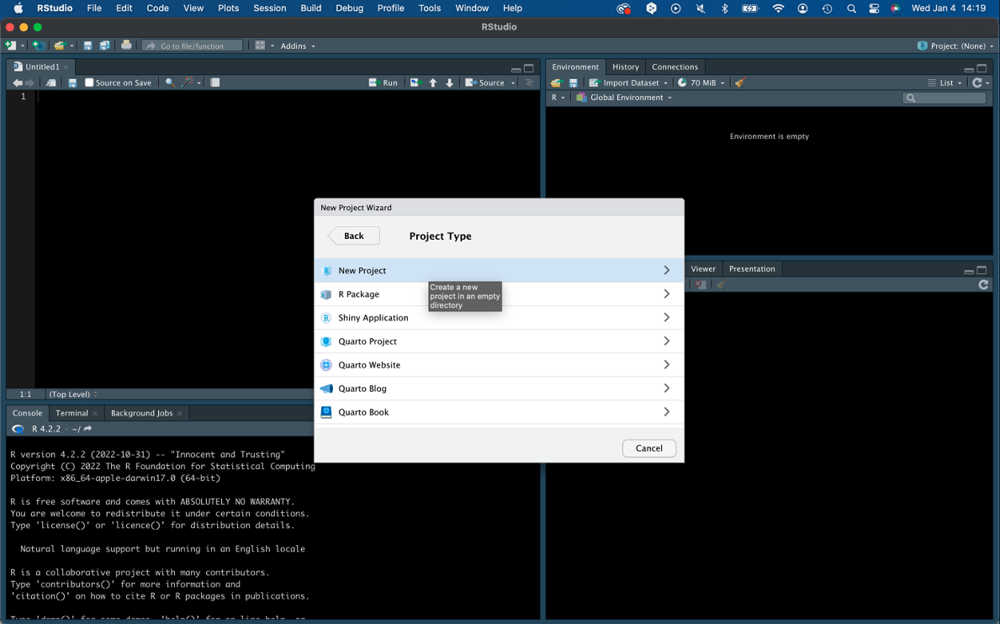
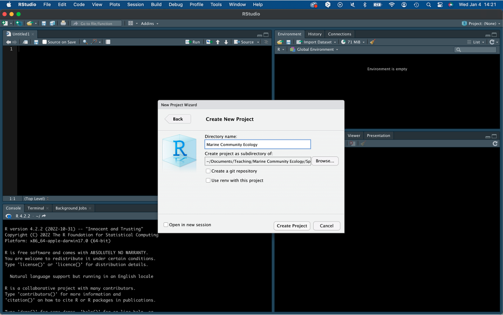
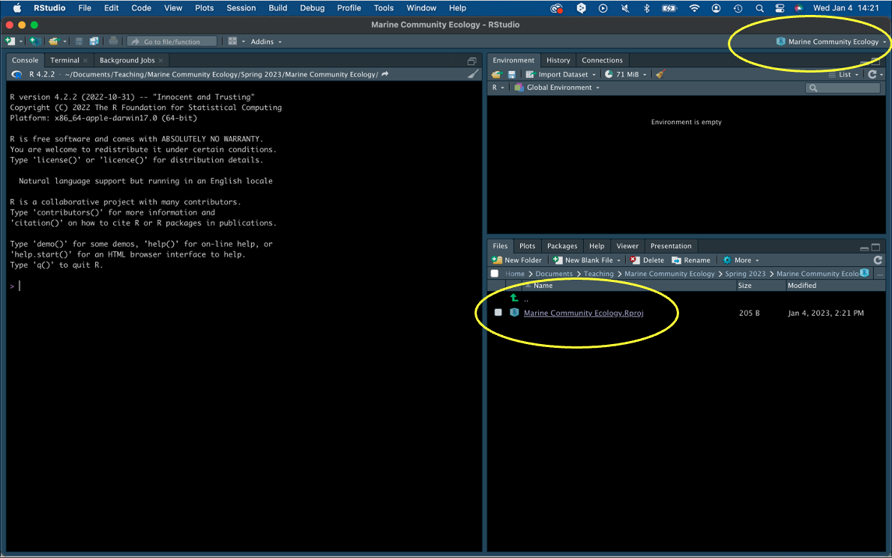
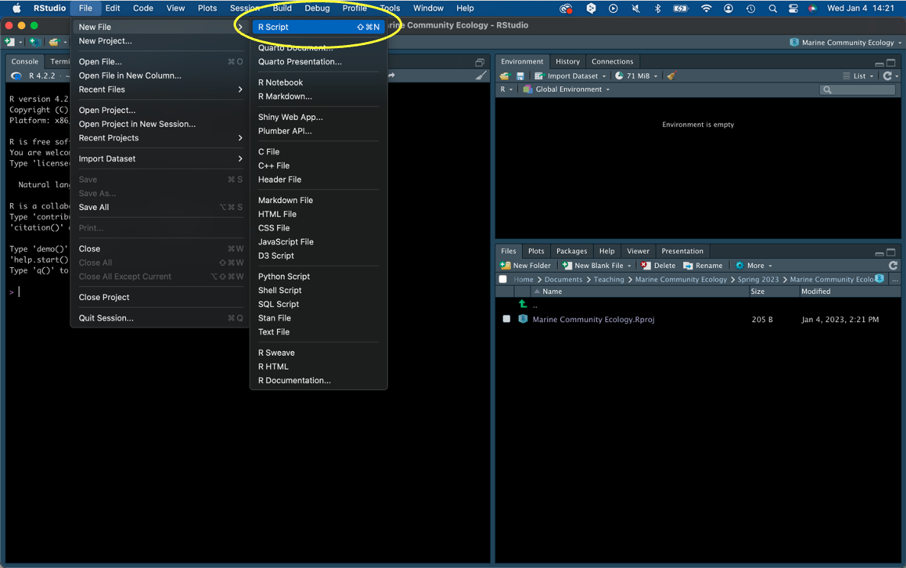
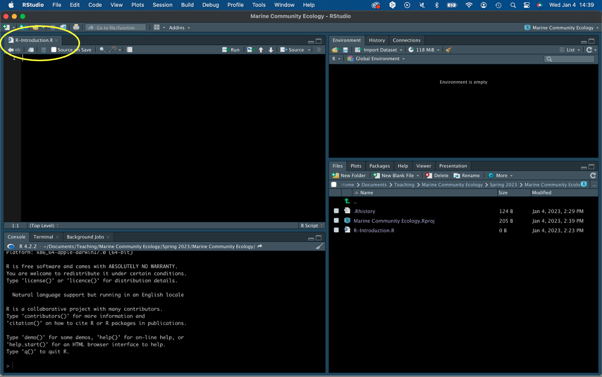
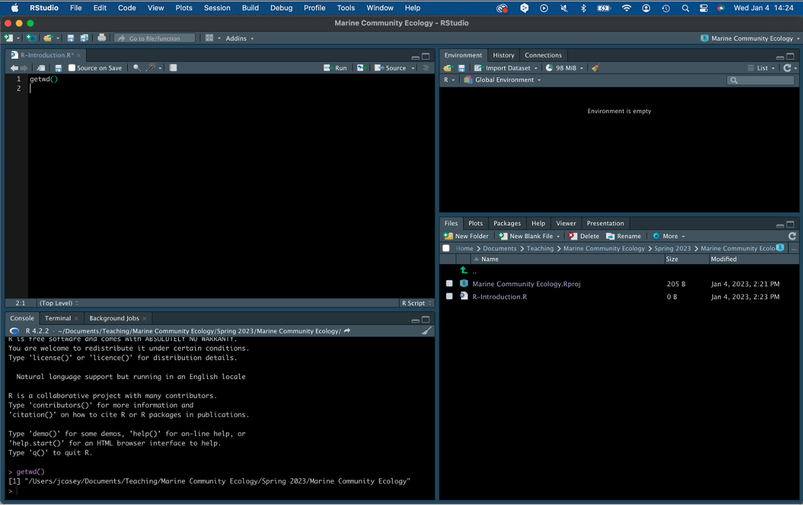

```{r xaringan-themer, include=FALSE, warning=FALSE}
### setup chunk
# load packages
library(xaringanthemer)
library(fontawesome)
library(emo)
library(tidyverse)
style_duo_accent_inverse(
  primary_color = "#85D3D1",
  secondary_color = "#0D2A47",
  header_font_google = google_font("Josefin Sans"),
  text_font_google   = google_font("Montserrat", "300", "300i"),
  code_font_google   = google_font("Fira Mono")
)
```

background-image: url("images/IMG_7366.jpeg")
background-size: cover
class: center, top, inverse

# Examining ecological communities in marine ecosystems using R


---
class: inverse, center, middle

# Copyright

These slides are part of the course entitled 'Marine Community Ecology,' co-developed by **Dr. Simon J. Brandl** and **Dr. Jordan M. Casey** and taught at The University of Texas at Austin [Marine Science Institute](https://utmsi.utexas.edu/)

All materials for the coding part of the course were created by the author using [R](https://www.r-project.org/) and [R Markdown](https://rmarkdown.rstudio.com/). Slideshows were produced using the [xaringan](https://github.com/yihui/xaringan) package.

All photos used in these presentations were taken by Dr. Casey and all code was written from scratch by Dr. Brandl and Dr. Casey. All scripts, files, and images necessary to complete the coding exercises are provided on [RPubs](https://rpubs.com/gobysimon) and [Github](https://github.com/simonjbrandl/mce2024).

---
class: center, middle

# Format of coding lessons

All coding lessons are structured as follows:

1) Watch a pre-recorded lecture that introduces you to the packages, operations, and objectives of each coding lesson. The recording and the slides used for the presentation will be available on Canvas. 

2) Perform a set of relatively easy exercises at home, which are usually to be submitted as homework. We will go through their solutions in class.

3) Work through a set of harder exercises in class. This will allow you to work in groups and with your instructors to solve problems and  deepen your coding skills.
---
class: center, bottom


# First steps 
# `r emo::ji("hatching_chick")`

.pull-left[1) Download the newest version of [R](https://www.r-project.org/) to your computer (click here for [Windows](https://cran.r-project.org/bin/windows/base/) or [macOS](https://cran.r-project.org/bin/macosx/)).


]

.pull-right[2) For user-friendly coding with mutliple panes and GUI, download [RStudio](https://posit.co/download/rstudio-desktop/) to your computer.


]

---
# Open RStudio 
.left-column[No need to open R separately. RStudio autonomously interfaces with R 
#`r emo::ji("gift")`]
```{r echo=FALSE, out.width="75%"}

```
---
# Create a new project 
.left-column[A project will keep all of your files in the same place, which is nice and tidy 
#`r emo::ji("broom")`] 
```{r echo=FALSE, out.width="75%"}

```
---
# Select 'New Directory'
.left-column[This allows you to host your project in a brand new local directory 
#`r emo::ji("new")`] 
```{r echo=FALSE, out.width="75%"}

```
---
# Select 'New Project'
.left-column[This is our default selection for writing code. One day, you may create a package 
#`r emo::ji("package")`] 
```{r echo=FALSE, out.width="75%"}

```
---
# Name your project
.left-column[You can locate the directory you want to save your project in during this step 
#`r emo::ji("magnifying")`] 
```{r echo=FALSE, out.width="75%"}

```
---
# Confirm you're in the right project 
.left-column[You will see the files present within your project directory (bottom-right panel), as well as an indication which project you are currently working in (top right) 
#`r emo::ji("check")`] 
```{r echo=FALSE, out.width="75%"}

```
---
# Create a new R-script
.left-column[R-scripts are a great interface for writing code 
#`r emo::ji("writing_hand")`] 
```{r echo=FALSE, out.width="75%"}

```
---

# Locate your new script
.left-column[The new script will open in the top left panel, usually named 'Untitled-1'. Save it to change the name. 
#`r emo::ji("save")`] 
```{r echo=FALSE, out.width="75%"}

```
---
# Writer a first line of code
.left-column[Writing getwd() in your script and running it (either with the 'Run' button or using Cmd+Enter [Mac] / CTRL+Enter [Windows]) will give you your current working directory. This is the path your project is saved under.) 
#`r emo::ji("arrow_right")`] 
```{r echo=FALSE, out.width="75%"}

```
---


You are recommended to use the [RStudio IDE](https://www.rstudio.com/products/rstudio/), but you do not have to.

- Create a new R Markdown document from the menu `File -> New File -> R Markdown -> From Template -> Ninja Presentation`;<sup>1</sup>

--

- Click the `Knit` button to compile it;

--

- or use the [RStudio Addin](https://rstudio.github.io/rstudioaddins/)<sup>2</sup> "Infinite Moon Reader" to live preview the slides (every time you update and save the Rmd document, the slides will be automatically reloaded in RStudio Viewer.

.footnote[
[1] 中文用户请看[这份教程](https://slides.yihui.org/xaringan/zh-CN.html)

[2] See [#2](https://github.com/yihui/xaringan/issues/2) if you do not see the template or addin in RStudio.
]

---
background-image: url(`r xaringan:::karl`)
background-position: 50% 50%
class: center, bottom, inverse

# You only live once!

---

# Hello Ninja

As a presentation ninja, you certainly should not be satisfied by the "Hello World" example. You need to understand more about two things:

1. The [remark.js](https://remarkjs.com) library;

1. The **xaringan** package;

Basically **xaringan** injected the chakra of R Markdown (minus Pandoc) into **remark.js**. The slides are rendered by remark.js in the web browser, and the Markdown source needed by remark.js is generated from R Markdown (**knitr**).

---

class: center, middle

# Thanks!

Slides created via the R package [**xaringan**](https://github.com/yihui/xaringan).

The chakra comes from [remark.js](https://remarkjs.com), [**knitr**](https://yihui.org/knitr/), and [R Markdown](https://rmarkdown.rstudio.com).
